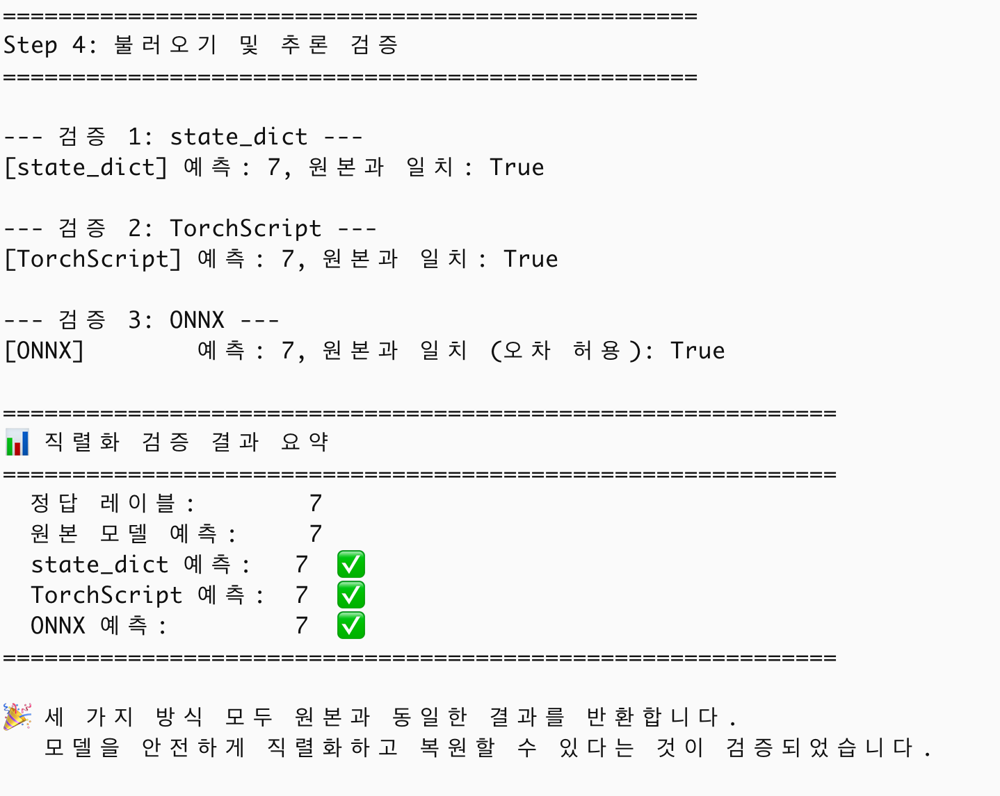
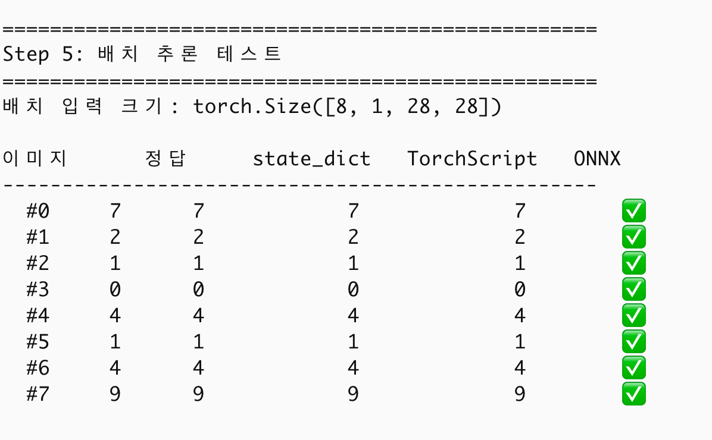
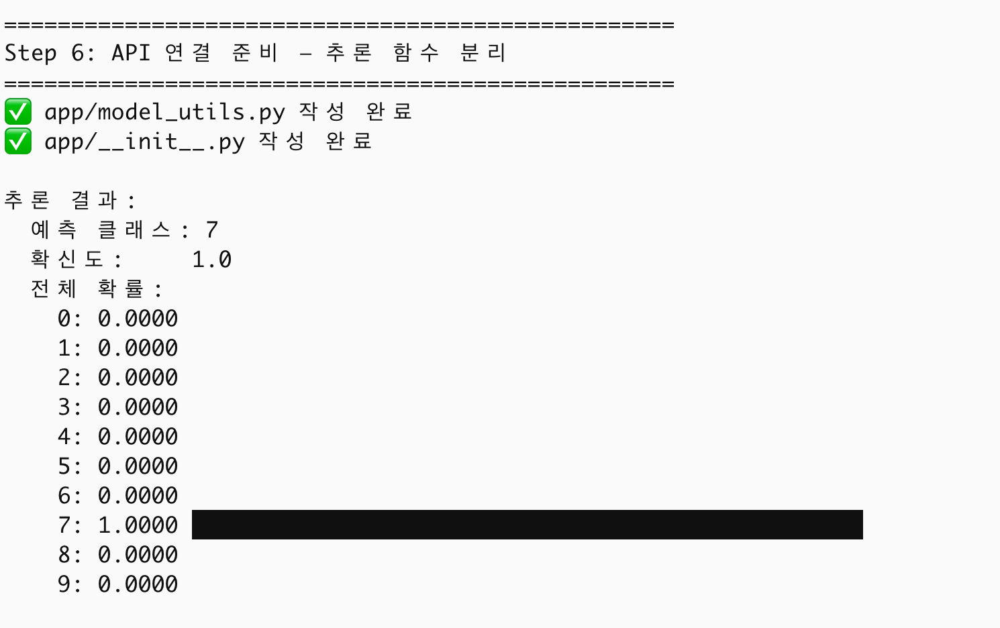
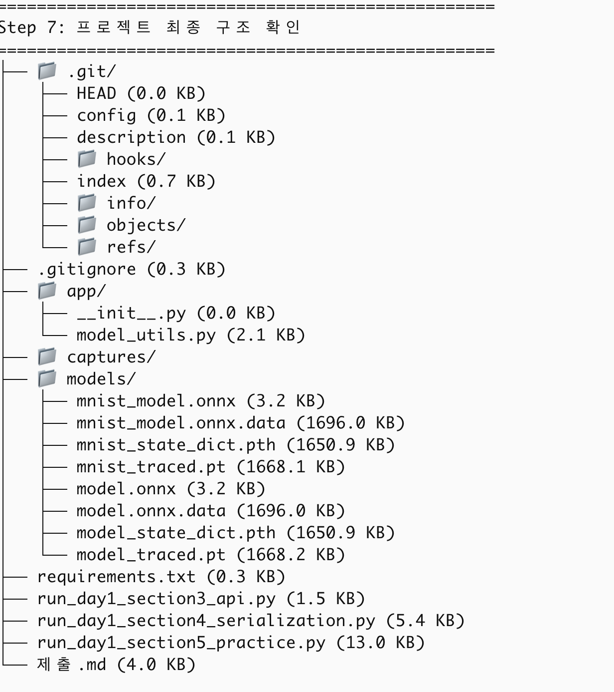

# 모델 배포 개론 Day 1 — 제출

> 작성: hyochan
> 과제: venv & requirements / RESTful API / 모델 직렬화(state_dict·TorchScript·ONNX) / MNIST 종합 실습

## 1. 5~7단계 수행 내역 (캡처)

### Step 4 — 직렬화 검증 결과 요약
> 세 방식(state_dict / TorchScript / ONNX)이 원본 모델과 동일한 예측을 내는지 검증.

### Step 5 — 배치 추론 테스트
> 8장 배치 입력에 대해 세 방식의 예측이 일치하는지 확인.

### Step 6 — 추론 함수 분리 (`app/model_utils.py`)
> `predict()`로 예측 클래스·확신도·전체 확률 분포 출력.

### Step 7 — 프로젝트 최종 구조

> 캡처 파일은 `captures/` 폴더에 넣고 위 경로명과 맞춘다.

## 2. 각 섹션 체크포인트 답변

### 섹션 1 — 들어가며
**Q1. 모델 학습과 모델 배포의 핵심 차이를 한 문장으로?**
학습은 "정확도 높은 모델을 만드는 것"이고, 배포는 "그 모델을 환경·언어에 상관없이 누구나 사용할 수 있는 서비스로 꺼내놓는 것"이다.

**Q2. "내 컴퓨터에서는 되는데" 문제의 근본 원인은?**
모델이 특정 실행 환경(라이브러리 버전, 모델 구조 코드, OS)에 묶여 있는데 그 환경이 상대방에게 공유·재현되지 않기 때문이다. 즉 환경이 통제되지 않은 것이 근본 원인이다.

### 섹션 2 — 환경 세팅
**Q3. 가상환경을 사용하지 않으면 어떤 문제가 발생하나?**
패키지가 전역에 설치되어 프로젝트마다 다른 버전이 서로 충돌하고, 동료/배포 환경에서 동일한 버전을 재현할 수 없게 된다.

**Q4. `pip freeze`와 직접 작성한 `requirements.txt`의 용도 차이는?**
직접 작성한 `requirements.txt`는 사람이 관리하는 핵심 패키지 목록으로 가독성이 좋다. `pip freeze` 결과는 하위 의존성까지 모든 버전을 고정한 정밀 재현용 목록이다. 실무에서는 둘을 병행한다.

### 섹션 3 — RESTful API
**Q5. 모델 추론 요청에 POST를 사용하는 이유는?**
추론은 입력 데이터를 요청 본문(body)에 담아 서버에 보내 "처리"를 요청하는 동작이기 때문이다. GET은 본문이 없고 조회·멱등성을 전제로 하므로 입력 전송에 부적합하다.

**Q6. 상태 코드 200, 400, 500은 각각 어떤 상황인가?**
200은 성공(요청이 정상 처리됨), 400은 클라이언트 잘못(요청 형식·값이 잘못됨), 500은 서버 내부 에러다. 4xx는 요청자 책임, 5xx는 서버 책임으로 구분된다.

### 섹션 4 — 모델 직렬화
**Q7. `state_dict` 방식은 왜 모델 클래스 정의가 필요한가?**
`.pth`에는 가중치(숫자 값)만 저장되고 레이어가 어떻게 연결되는지(구조)는 저장되지 않는다. 따라서 동일한 클래스로 구조를 먼저 만든 뒤 그 위에 가중치를 채워 넣어야 복원된다.

**Q8. ONNX의 가장 큰 장점과 사용해야 할 시점은?**
프레임워크·언어에 독립적이어서 어디서든 실행 가능하고, ONNX Runtime·TensorRT 등으로 추론 속도를 최적화할 수 있다. 추론 성능이 중요한 프로덕션이나 PyTorch가 아닌 환경(C++/C#/다른 프레임워크)에 배포할 때 선택한다.

### 섹션 5 — 실습
**Q9. 모델 저장 전에 `model.eval()`을 호출해야 하는 이유는?**
Dropout·BatchNorm 등은 학습 모드와 추론 모드의 동작이 다르다. eval 모드로 전환하지 않고 저장하면 추론 시 일관되지 않은(잘못된) 결과가 나올 수 있다.

**Q10. `predict()` 함수를 별도 모듈로 분리한 이유는?**
전처리·로드·추론 로직을 한 곳에 모아 재사용성을 높이고, FastAPI 엔드포인트가 `import`만 하면 바로 쓸 수 있도록 학습/실험 코드와 서빙 코드를 분리하기 위함이다.

---
수고하셨습니다!
